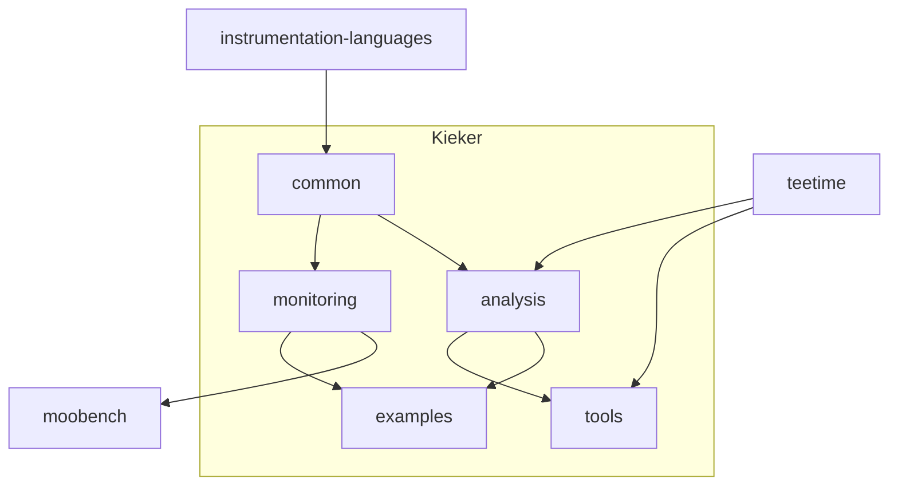

# Kieker Monitoring Organization

This organization manages all repositories that belong to the Kieker community. These include:
- The main **Kieker** project, including the main monitoring and analysis code, and tools and examples
- The **MooBench** project, that continuously benchmarks the overhead of Kieker monitoring
- The **TeeStore** project, that provides a pipe & filter architecture for Kieker

## Component Dependencies

