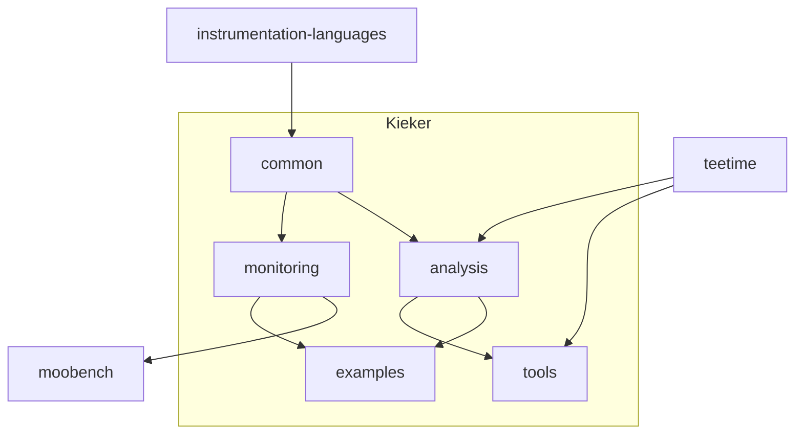

# Kieker Monitoring Organization

This organization manages all repositories that belong to the Kieker community. These include:
- The main **Kieker** repository, including 
  - the main **monitoring** and **analysis** code, their **common** code, and 
  - the **tools** and **examples** that are using them
- The **instrumentation-languages** repository, that make it possible to generate the monitoring records that are use in **kieker:common**
- The **MooBench** repository, that continuously benchmarks the overhead of Kieker monitoring
- The **TeeTime** repository, that provides a pipe & filter architecture for Kieker

## Component Dependencies

