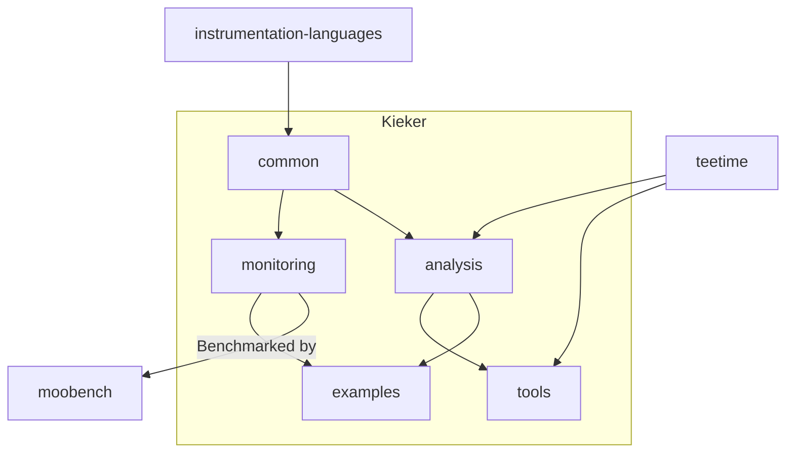

# Kieker Monitoring Organization

This organization manages all repositories that belong to the Kieker community. These include:
- The main [Kieker](https://github.com/kieker-monitoring/kieker) repository, including 
  - the main **monitoring** and **analysis** code, their **common** code, and 
  - the **tools** and **examples** that are using them
- The [instrumentation-languages](https://github.com/kieker-monitoring/instrumentation-languages) repository, that make it possible to generate the monitoring records that are use in **kieker:common**
- The [MooBench](https://github.com/kieker-monitoring/moobench) repository, that continuously benchmarks the overhead of Kieker monitoring
- The [TeeTime](https://github.com/kieker-monitoring/teetime) repository, that provides a pipe & filter architecture for Kieker

## Component Dependencies

